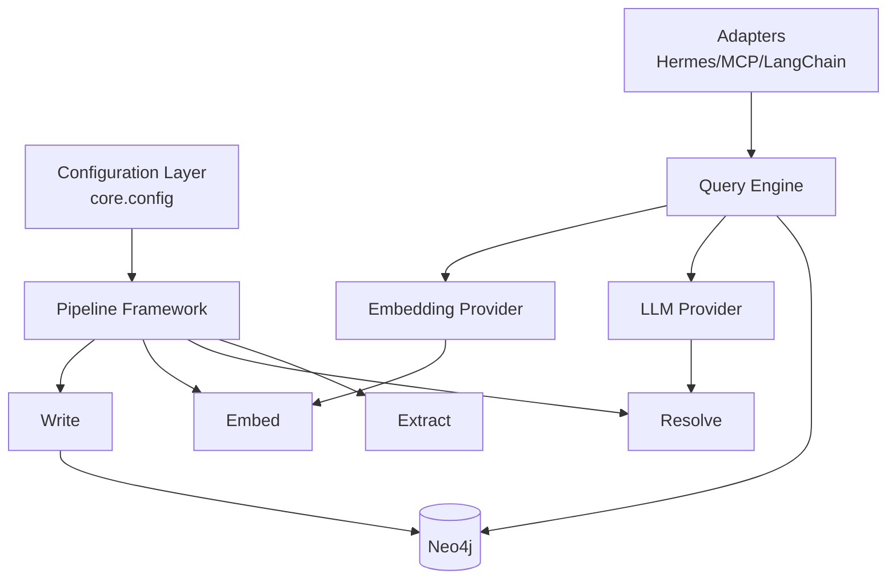

# Architecture Deep Dive

## 1) Why a Property Graph?

`agent-knowledge-graph` uses a property graph because memory retrieval for agents is relationship-heavy, not just document retrieval.

- **Against pure RDBMS**: SQL tables can model entities, but multi-hop traversal and relationship semantics become verbose and brittle as ontology evolves.
- **Against vector-only stores**: vectors recover semantic neighbors but lose explicit structure and provenance edges.
- **Hybrid advantage**: Neo4j traversal plus vector search provides both graph precision and semantic recall.

## 2) Design Tenets

- **Generic core**: avoid binding business logic to a single agent framework.
- **Agent-agnostic adapters**: Hermes, MCP, and LangChain all map to a shared query model.
- **Local-first defaults**: local Neo4j and file-based config keep setup straightforward.
- **Incremental ingestion**: checkpoints and idempotent upserts reduce repeat work.

## 3) Layer Diagram

## 4) Pipeline Lifecycle

### Checkpointing

Pipelines read their last `PipelineCheckpoint` to continue from a known source position. The framework writes updated checkpoints after successful writes.

### Idempotency

Write operations are upserts. Reprocessing the same resources should converge to stable graph state rather than duplicating nodes.

### Incremental Builds

Pipelines can run repeatedly with small batches. This supports daemonized ingestion (`kg watch`) and frequent agent memory refresh.

## 5) Query Flow

1. User asks a natural-language question.
2. `QueryEngine.nl_query()` prompts the LLM with schema guidance.
3. Model returns Cypher (fence-stripped and validated as non-empty).
4. Graph executes query and returns rows.
5. CLI and adapters render rows, generated Cypher, and timing metadata.

Failure domains are intentionally separated:

- translation failure -> LLM error
- execution failure -> Cypher runtime error
- empty translation -> explicit empty-query error

## 6) Plugin Architecture

### Hermes Plugin Lifecycle

- Plugin instantiates lazily with no immediate provider setup.
- First tool call resolves config, graph, embedder, and LLM.
- Engine is cached for subsequent calls.

### MCP Handler Registration

`create_mcp_handlers()` returns:

- `handlers`: async tool functions (`kg_query`, `kg_semantic_search`, `kg_traverse`)
- `close`: lifecycle hook for graph cleanup
- `get_graph`: optional access for health/system checks

This keeps adapter boundaries thin while preserving a shared core query path.
