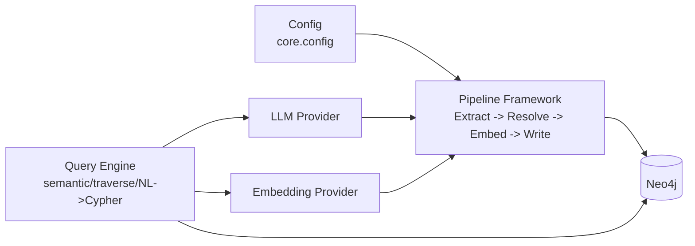
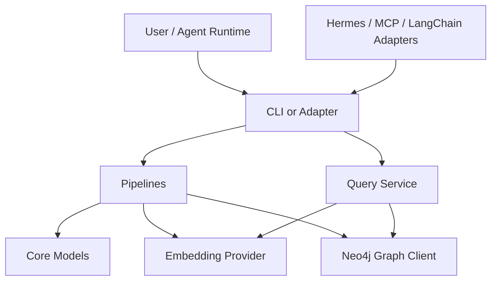

# agent-knowledge-graph

[](https://github.com/vikasudasi/agent-knowledge-graph/actions)
[](LICENSE)
[](https://www.python.org/)
[](https://github.com/vikasudasi/agent-knowledge-graph/actions)

## 1) Overview

`agent-knowledge-graph` is a local-first memory system for AI agents. It ingests session artifacts into a Neo4j-backed property graph, augments nodes with embeddings for semantic recall, and supports natural-language query flows that translate user intent to Cypher.

## 2) Features

- Property graph storage in Neo4j with typed `Resource` nodes and relationships
- NL to Cypher querying via pluggable LLM provider abstractions
- Semantic and hybrid retrieval via configurable embedding providers
- Pluggable extract/resolve/embed/write ingestion pipelines
- Agent adapters for Hermes plugins, MCP, and LangChain tools

## 3) Architecture

The core runtime wires config, providers, and ingestion/query layers around a single graph substrate:



## 4) Quick Start

```bash
pip install agent-knowledge-graph
kg init --with-docker
docker compose up -d
kg build run all
kg query ask "what do I know about deployment regressions?"
```

If you are developing from source:

```bash
git clone https://github.com/vikasudasi/agent-knowledge-graph.git
cd agent-knowledge-graph
uv sync
uv run kg --help
```

## 5) Configuration

The project follows XDG configuration conventions and reads `KG_*` environment overrides.

- Default config: `~/.config/agent-knowledge-graph/config.yaml`
- Legacy fallback: `~/.agent-knowledge-graph.yaml`

| Key | Env Var | Purpose |
|---|---|---|
| `llm.provider` | `KG_LLM_PROVIDER` | LLM backend (`openrouter`, `openai`, etc.) |
| `llm.api_key` | `KG_LLM_API_KEY` | API key for LLM provider |
| `llm.base_url` | `KG_LLM_BASE_URL` | Provider API base URL |
| `embedding.provider` | `KG_EMBEDDING_PROVIDER` | Embedding backend |
| `embedding.dimension` | `KG_EMBEDDING_DIMENSION` | Embedding vector dimension |
| `neo4j.uri` | `KG_NEO4J_URI` | Neo4j Bolt URI |
| `neo4j.user` | `KG_NEO4J_USER` | Neo4j user |
| `neo4j.password` | `KG_NEO4J_PASSWORD` | Neo4j password |
| `neo4j.database` | `KG_NEO4J_DATABASE` | Neo4j database |
| `storage.data_dir` | `KG_DATA_DIR` | Local data directory |

## 6) CLI Reference

### `kg init`

- Initialize schema: `kg init`
- Reset then initialize: `kg init --reset`
- Auto-start Docker first: `kg init --with-docker`

### `kg build`

- List pipelines: `kg build list-pipelines`
- Run one pipeline: `kg build run session-ingest`
- Run all pipelines: `kg build run all --rebuild`

### `kg query`

- Semantic: `kg query semantic "incident summary" --top 5`
- Traverse: `kg query traverse session:123 --hops 2 --dir both`
- NL ask: `kg query ask "What decisions mention Neo4j?"`
- Explain Cypher: `kg query explain "MATCH (n:Resource) RETURN n LIMIT 5"`

### `kg status`

- Full status: `kg status status`
- Health check: `kg status health`

### `kg visualize`

- Overview tree: `kg visualize tree`
- Rooted tree: `kg visualize tree session:123 --depth 2 --max 10`

### `kg watch`

- Continuous: `kg watch watch --interval 60`
- One pass: `kg watch watch --pipeline session-ingest --once`

### `kg llm`

- Connectivity ping: `kg llm ping`
- Structured extraction smoke test: `kg llm extract`

## 7) Pipelines

Built-in pipeline:

- `session-ingest`: reads Hermes session DB, extracts structured knowledge, embeds resources, and writes nodes plus mention relationships.

Custom pipelines should subclass `KnowledgePipeline` and implement:

1. `extract(context, checkpoint)`
2. `resolve(context, record)`
3. optional `get_relationships(context, records, resources)`

See `PIPELINES.md` for the full authoring guide.

## 8) Query Layer

- **Semantic**: vector similarity search over embedded resources
- **Traverse**: hop-based relationship exploration around a seed node
- **Hybrid**: vector search with graph-filter constraints
- **NL to Cypher**: LLM-generated Cypher executed through the graph client

Examples:

```bash
kg query semantic "retry policy" --top 8
kg query traverse entity:redis --hops 2
kg query ask "Which sessions mention rollout failures?"
kg query explain "MATCH (a)-[r]->(b) RETURN a,r,b LIMIT 10"
```

## 9) Agent Adapters

- **Hermes Plugin**: direct plugin surface exposing `kg_query`, `kg_semantic_search`, `kg_traverse`, `kg_stats`
- **MCP Server Handlers**: async handler map for MCP tool registration
- **LangChain Tools**: optional tool classes when `langchain_core` is installed

See `AGENTS.md` for setup and comparison details.

## 10) Docker

Use bundled compose for local Neo4j:

```bash
docker compose up -d
docker compose ps
kg docker status
kg docker down
```

Helpful script: `scripts/run-neo4j.sh`

## 11) Development

```bash
uv sync --extra dev
uv run pytest
uv run ruff check .
uv run ruff format --check .
uv run mypy core cli pipelines adapters
```

For contribution process, see `CONTRIBUTING.md`.

## 12) FAQ

### Is this only for Hermes?

No. The core is agent-agnostic; Hermes is one adapter.

### Can I run without LLM keys?

Yes for graph operations, status, and many CLI flows. LLM-backed commands require a key.

### Is Neo4j required?

Yes in the current architecture. Docker compose is included for local use.

### Can I write my own pipeline?

Yes. Extend `KnowledgePipeline` and register with `PipelineRegistry`.

### Does LangChain have to be installed?

No. LangChain adapter code degrades gracefully when optional dependencies are absent.

## 13) License

This project is licensed under MIT. See `LICENSE`.

## 14) Changelog

Initial release notes are tracked in `CHANGELOG.md`.
# test
# agent-knowledge-graph

[](https://github.com/vikasudasi/agent-knowledge-graph/actions/workflows/test.yml)
[](https://github.com/vikasudasi/agent-knowledge-graph/actions/workflows/test.yml)
[](https://www.python.org/downloads/)
[](LICENSE)

Persistent knowledge graph memory for AI agents.

`agent-knowledge-graph` is an open-source CLI + Python library that gives agent systems durable, queryable, semantically searchable memory. It stores structured events in Neo4j, augments them with embeddings, and enables natural-language retrieval over graph context.

## Table of Contents

1. [Why This Exists](#why-this-exists)
2. [Key Features](#key-features)
3. [System Requirements](#system-requirements)
4. [Installation](#installation)
5. [Quick Start](#quick-start)
6. [Usage Examples](#usage-examples)
7. [CLI Reference](#cli-reference)
8. [Architecture Overview](#architecture-overview)
9. [Configuration Reference](#configuration-reference)
10. [Pipeline System](#pipeline-system)
11. [Agent Adapters](#agent-adapters)
12. [Development Workflow](#development-workflow)
13. [Contributing](#contributing)
14. [FAQ](#faq)
15. [License](#license)

## Why This Exists

Most AI agents forget context between sessions. That causes repeated work, weak continuity, and fragile long-running automation. Flat transcript logs help with auditing, but they do not provide:

- Entity-level memory across sessions.
- Relationship-aware retrieval.
- Semantic lookup for paraphrased questions.
- Clear lineage from source event to generated answer.

`agent-knowledge-graph` addresses this with a graph-first memory model:

- **Graph memory** captures entities, events, tools, files, and their relationships.
- **Vector memory** supports semantic recall when exact keywords are absent.
- **NL->Cypher pathways** allow natural language questions to become graph queries.

The goal is simple: agents should retain useful context over time without sacrificing traceability.

## Key Features

- Typer-powered `kg` CLI for initialization, ingestion, querying, and status checks.
- Neo4j-backed graph persistence for entities, sessions, and relation edges.
- Sentence-transformer embeddings for semantic search over memory content.
- Extensible pipeline architecture for session, repo, and artifact ingestion.
- Adapter surface for Hermes, MCP, and LangChain-based agent runtimes.
- Strong developer ergonomics with `uv`, `pytest`, `ruff`, `mypy`, and CI workflows.

## System Requirements

- Python 3.11 or newer.
- `uv` installed locally.
- Docker (optional but recommended) for local Neo4j.
- Linux/macOS/WSL recommended for development parity.

Install `uv` if needed:

```bash
curl -LsSf https://astral.sh/uv/install.sh | sh
```

## Installation

### 1) Install from source (editable)

```bash
git clone https://github.com/vikasudasi/agent-knowledge-graph.git
cd agent-knowledge-graph
uv sync
```

### 2) Install as package

```bash
pip install agent-knowledge-graph
```

### 3) Development install with toolchain

```bash
uv sync --extra dev
pre-commit install
```

### 4) Optional adapter extras

```bash
uv sync --extra hermes --extra mcp
```

## Quick Start

1. **Clone and sync dependencies**
   ```bash
   git clone https://github.com/vikasudasi/agent-knowledge-graph.git
   cd agent-knowledge-graph
   uv sync
   ```
2. **Start Neo4j**
   ```bash
   docker compose up -d
   ```
3. **Inspect CLI**
   ```bash
   uv run kg --help
   ```
4. **Initialize graph schema**
   ```bash
   uv run kg init
   ```
5. **Run first query**
   ```bash
   uv run kg query "What do we know about deployment incidents this week?"
   ```

At scaffold stage, commands print implementation status messages while preserving final command shape.

## Usage Examples

### Initialize storage

```bash
uv run kg init
```

Expected output:

```text
[kg] init not yet implemented
```

### Reinitialize from clean state

```bash
uv run kg init --reset
```

### Build pipeline data

```bash
uv run kg build sessions --full
uv run kg build sessions --limit 250
```

Example output:

```text
[kg] build sessions not yet implemented
```

### Query from natural language

```bash
uv run kg query "Summarize unresolved reliability risks from the last five sessions"
uv run kg query "MATCH (i:Incident) RETURN i LIMIT 5" --cypher
uv run kg query "list session memory nodes" --json
```

Example output:

```text
[kg] query not yet implemented
```

### Check system status

```bash
uv run kg status
```

Expected output:

```text
[kg] status not yet implemented
```

## CLI Reference

| Command | Arguments | Options | Description |
|---|---|---|---|
| `kg init` | None | `--reset` | Initialize Neo4j and create schema objects. |
| `kg build` | `pipeline` | `--full`, `--limit` | Run an ingest pipeline (sessions, files, etc.). |
| `kg query` | `question` | `--cypher`, `--json` | Query memory via natural language or raw Cypher mode. |
| `kg status` | None | None | Show graph health and ingest statistics. |

### Global CLI behavior

- Rich-formatted help text.
- Deterministic command signatures for automation scripts.
- Entry point: `kg = cli.main:app`.

## Architecture Overview

The system is split into composable layers so data contracts remain stable even as providers evolve.



### Layer responsibilities

- **CLI**: command parsing, UX, invocation orchestration.
- **Pipelines**: ingest and enrichment workflows.
- **Core**: config, graph driver, embeddings, and LLM abstraction.
- **Adapters**: integration glue for external agent ecosystems.

## Configuration Reference

Configuration values are expected to support environment variables plus config-file fallback.

| Key | Purpose | Example |
|---|---|---|
| `KG_NEO4J_URI` | Neo4j Bolt URI | `bolt://localhost:7687` |
| `KG_NEO4J_USER` | Neo4j username | `neo4j` |
| `KG_NEO4J_PASSWORD` | Neo4j password | `password` |
| `KG_EMBEDDING_MODEL` | Sentence-transformer model ID | `all-MiniLM-L6-v2` |
| `KG_LLM_BASE_URL` | OpenRouter/provider base URL | `https://openrouter.ai/api/v1` |
| `KG_LLM_API_KEY` | LLM API key | `sk-...` |
| `KG_LOG_LEVEL` | Logging level | `INFO` |

Planned behavior:

- Validate config with Pydantic.
- Support local project config + user-level config.
- Provide explicit startup diagnostics for missing critical keys.

## Pipeline System

Pipelines convert raw artifacts into typed memory records with provenance.

### Pipeline lifecycle

1. Discover source data (sessions, files, events).
2. Normalize into canonical record models.
3. Enrich records with embeddings and metadata.
4. Upsert graph nodes and relationships.
5. Emit ingest stats and diagnostics.

### Design principles

- Idempotent runs where feasible.
- Clear retry boundaries.
- Small composable steps for observability.
- Explicit schema migrations for graph evolution.

## Agent Adapters

`agent-knowledge-graph` is designed to meet agents where they already run.

### Hermes adapter

- Plugin-based integration for event hooks.
- Captures session decisions and tool interactions.

### MCP adapter

- Exposes memory operations as MCP tools.
- Allows generic MCP clients to query and update memory.

### LangChain adapter

- Tool wrapper for retrieval-augmented chains.
- Enables memory lookup inside chain and agent plans.

## Development Workflow

### Local commands

```bash
uv sync --extra dev
uv run pytest
uv run ruff check .
uv run ruff format --check .
uv run mypy core/ cli/ pipelines/
```

### Pre-commit checks

This repository uses pre-commit hooks for:

- Ruff linting and formatting.
- Mypy type checks.
- Basic YAML and whitespace hygiene checks.

### CI pipelines

- `test.yml`: runs pytest + coverage across Python 3.11 and 3.12.
- `lint.yml`: runs `ruff check` and `ruff format --check`.
- `typecheck.yml`: runs strict mypy on key packages.
- `build.yml`: builds artifacts on version-tag pushes.

## Contributing

Contributions are welcome and encouraged.

1. Fork the repo and create a branch.
2. Keep changes focused and include tests where possible.
3. Run local quality gates before opening a PR.
4. Document architectural impacts in `docs/` when relevant.
5. Prefer small reviewable pull requests over large rewrites.

Suggested branch naming:

- `feat/<topic>`
- `fix/<topic>`
- `chore/<topic>`

Commit message style example:

- `feat(pipeline): add session ingest skeleton`

## FAQ

### Do I need Docker?

No, but it is the easiest way to run Neo4j locally. If you already have a Neo4j 5.x instance, point configuration to that endpoint.

### Do I need an API key?

Not for basic CLI scaffolding and graph-only operations. You only need an API key when enabling LLM-backed query translation or summarization.

### Is this production-ready?

The current scaffold is designed for fast iteration and extension. Core architecture and tooling are in place; domain logic will be expanded incrementally.

### Can I use only the Python library and skip the CLI?

Yes. The package is structured so core and pipeline modules can be imported directly in services or notebooks.

## License

This project is licensed under the MIT License. See [LICENSE](LICENSE) for full text.
